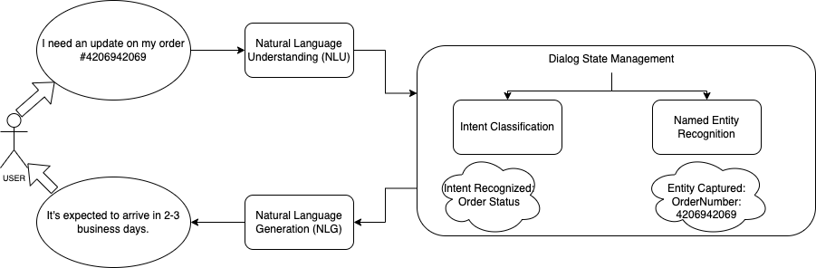
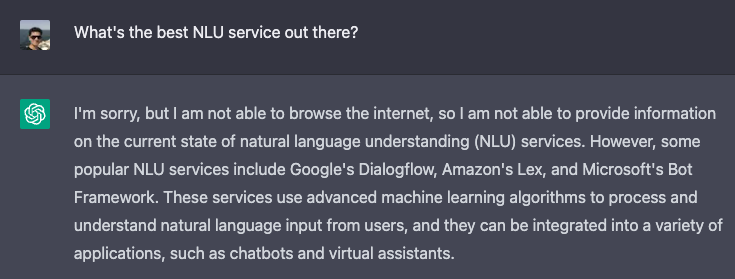
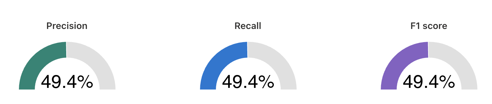
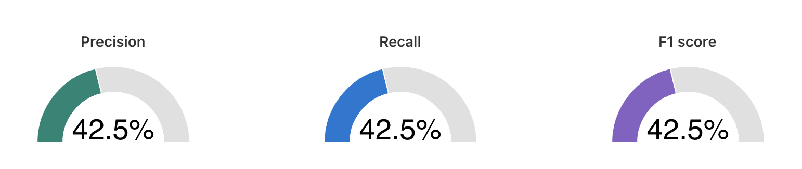
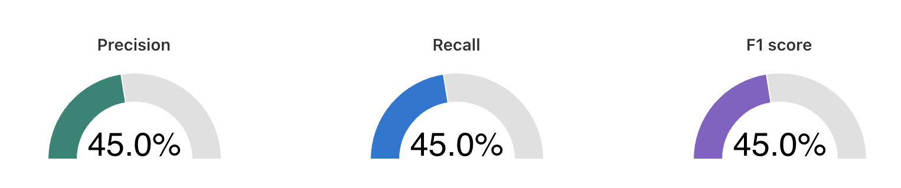
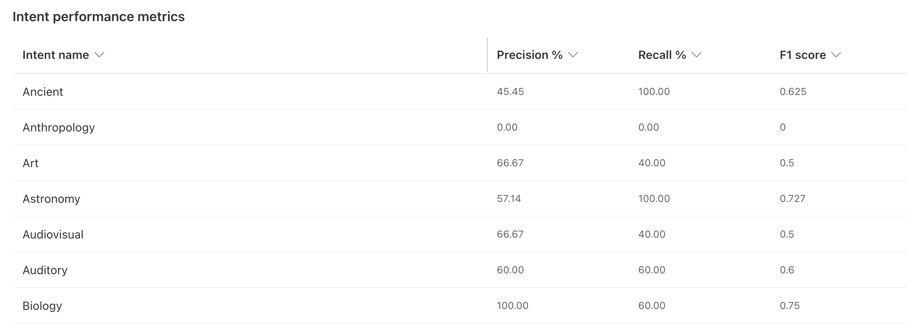
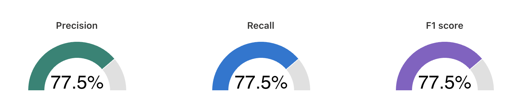
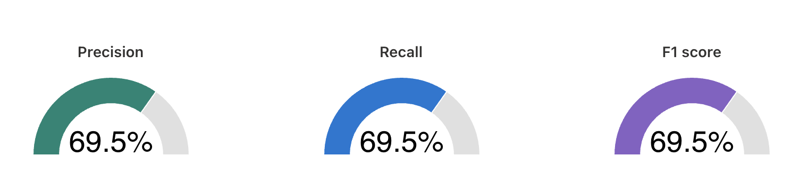
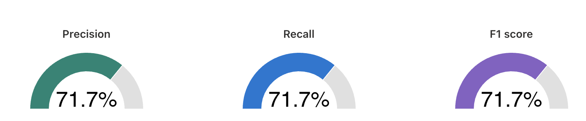
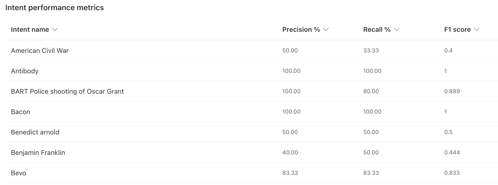

# Comparison of NLU Services on QnA Datasets

## Contents
1. [Background](#background)
2. [Motivation](#motivation)
3. [Similar Works](#similar-works)
4. [Project Overview](#project-overview)
5. [Datasets](#datasets)
6. [NLU Services](#nlu-services)
7. [Evaluation](#evaluation)
8. [Approach](#approach)
9. [Results](#results)
10. [Conclusion](#conclusion)
11. [Future Scope](#future-scope)
12. [References](#references)

## Background

Before we dive into the project specifics, let's build some context so we know what we're dealing with.

A place to start perhaps is by talking a little bit about **chatbots**. Now, though chatbots aren't new and have been there since the days of [ELIZA](https://en.wikipedia.org/wiki/ELIZA), they've rapidly grown in terms of commercial use in the last few years. The next time you try reaching out to a customer support personel on Amazon or Uber or most applications, you're routed to essentially a chatbot that acts as your human-like customer support personel.

So, now let's talk about what a chatbot entails on a high level. The diagram below illustrates how the aforementioned Amazon chatbot might operate:  

When the user asks "I need an update on my order #OrderNumber", the bot uses NLU to breakdown this *utterance* into an intent and capture any entities present within the utterance. So, if we'd trained our model to detect this utterance as belonging to an *OrderStatus* intent and had an NER model that captures the entity *OrderNumber*, the bot would then fulfill the user's request by generating (NLG) an appropriate response.

Now, to segue onto **NLU services**. What NLU services seek to do is provide a platform that takes care of all of these different components involved, mainly having an intent classifier, an NER model and a platform that lets you receive input utterances and trigger output responses. 

## Motivation
*This section is not necessary to follow along, you may skip this if you wish to.*

I thought it'd be interesting to state what led me to work on this project and also why it may be of relevance in the real-world.

Between 2019 and 2021, I spent time at the industry building chatbots and conversational agents, using quite a few of the NLU services that's covered in this project. Then, earlier this year, I worked on a project where we sought to compare the performance of transformer language models on QnA systems. You may find the highlights [here](https://drive.google.com/file/d/1YUpxStK_sRAlAVDBTjaoCo_WLL0l1Rj7/view?usp=share_link)

So, mainly I wanted to build on top of this to see how they're connected. One of the [datasets](https://huggingface.co/datasets/wiki_qa/viewer/default/train) used for this project is the one from the previous project. I hope to use the results from this project and tie it to the previous one in the near future.

Speaking of relevance in the real-world, most companies that find a need for a chatbot solution in either their products or operations tend to rely on the NLU services mentioned in this project. Now, if you're starting out and are trying to decide what platform to adopt, you're going to need to do some due diligence and this project tries to help with that.

Oh, and I also had to see if ChatGPT can help with this:

As it turns out, not yet. So, this project should be of significance right!? :)

## Similar Works
*This section is not necessary to follow along, you may skip this if you wish to.*

I tried to see if someone's done anything similar in the past and found a few interesting papers:
- [Evaluating Natural Language Understanding Services for Conversational Question Answering Systems](https://aclanthology.org/W17-5522.pdf)
- [Performance Comparison of Natural Language Understanding](https://thesai.org/Downloads/Volume11No8/Paper_92-Performance_Comparison_of_Natural_Language_Understanding.pdf)
- [An Evaluation Dataset for Intent Classification](https://aclanthology.org/D19-1131.pdf)
- [A Comparison of Natural Language Understanding Services to build a chatbot in Italian](https://ceur-ws.org/Vol-2735/paper36.pdf)
- [Benchmarking Natural Language Understanding Services for building Conversational Agents](https://arxiv.org/pdf/1903.05566.pdf)

The first one on this list by Braun et. al seems to be referenced in some of the other papers that came after, and is also what I used as a starting point for this project. 

Now, the primary reason why this project might still be relevant is the fact that all of these papers are at least two years old, some even older, and that's a **long** time given how rapidy this field is evolving. The platforms themselves have undergone major updates, some ways of doing things earlier have since been deprecated. Further, if you tried to use the scripts provided by Braun et. al found [here](https://github.com/sebischair/NLU-Evaluation-Scripts), they would no longer be valid for any of the platforms.

## Project Overview

This project compares major NLU service platforms by training data from two distinct datasets. These datasets were chosen because they offer training utterances from myriad domains, helping test the robustness of the models used by these platforms.
Ultimately, the results from this project seeks to help those planning on building chatbot-like solutions either for commercial or research purpose some pointers on what service to adopt.

## Datasets
Two datasets were used for the purposes of the project.

1. The [Qanta](https://huggingface.co/datasets/qanta) dataset which is a question-answering dataset based on the academic trivia game Quizbowl.
2. The [Wiki](https://huggingface.co/datasets/wiki_qa) Question Answering corpus from Microsoft, which is a set of question and sentence pairs, annotated for open-domain question-answering.

## NLU Services
The NLU services considered are as follows:

1. Microsoft [CLU](https://language.cognitive.azure.com/clu/) (new offering from Microsoft that replaces [Luis](https://luis.ai/), their former NLU service)
2. [Dialogflow](https://dialogflow.cloud.google.com/) EX by Google
3. Amazon [Lex](https://us-east-1.console.aws.amazon.com/lexv2/) V2
4. [Watson](https://cloud.ibm.com/apidocs/assistant/assistant-v2) Assistant V2 by IBM
5. [Wit.ai](https://wit.ai/) by Meta
6. [Rasa](https://rasa.com/docs/rasa/) Open Source

To report final results, only the **first three** were compared and contrasted.

This is because Watson does not allow training multiple bots and has an intent limit lesser than what the project needed in their free-tier version, and I had difficulties validating payments while trying to sign up for a trial for the higher versions.

For Wit.ai, batch import seemed to be an issue, which would make it quite complex to feed in our training data.

Rasa has been undergoing changes in their services. Infact, they most recently updated some of their APIs on 12/9/2022, which is two days prior at the time of this writing. More on this may be found [here](https://rasa.com/docs/rasa/action-server/)
What was interesting however was Rasa seemed to be the only open-source service of the options listed. With that, it shed some light into the models used by these services. It uses [MITIE](https://ceur-ws.org/Vol-1691/paper_16.pdf) on its backend.

## Evaluation

The metric used to evaluate performance of the services was the **F1 score**.
For each intent, the data was split into train and test sets in the ratio 80%-20%.
*Precision* and *recall* were computed for each.
For example, if we had an utterance in our test set: "What was the signifance of the emancipation proclamation during the civil war?", and we know this is to be classified as the intent "American Civil War". If the model correctly classifies this, it's a true positive. 

Both, the quizbowl data and wiki data were evaluated separately across all the services.
The final results are reported [here](#results)

## Approach
*This section may be used as reference to replicate the project.*

The project's pipeline may be categorized into four steps on a broad-level.

1. Exporting necessary data from datasets

The datasets used in this project were both on huggingface and as such, I created a notebook on colab in order to use the library [datasets](https://pypi.org/project/datasets/) which lets you load datasets from huggingface directly onto python.
The necessary data from both the quizbowl and wiki data were then exported as json files.
All of this may be found in the python notebook [here](./scripts/NLU_Services.ipynb)

2. Creating accounts on cloud platforms

The links mentioned in the [NLU services](#nlu-services) section should provide the links to the respective services. In order to use the NLU services, you'd need to create an account on their websites and since most of these services are part of cloud platforms like Dialogflow being part of Google Cloud Platform (GCP), you'd need to sign up for a cloud account. Depending on the platform, you might have to sign up with a credit card on file. To get the results obtained in this project, the free tier options worked just fine.

3. Preparing your data per NLU platform requirements

Now, in order for you to be able to train all your utterances, your data has to be in the format expected by the respective NLU platform. 
You would want to refer the documentation to get an idea of this format and then get your data in the needed format.
For example, here's [Lex's](https://docs.aws.amazon.com/lexv2/latest/dg/import-export-format.html) requirements.
Another thing worth mentioning is also the requirements of characters permitted while naming intents and in utterances. It's also important that you check the maximum limits for number of limits and size of utterances in each service. For example, the free tier of Microsoft's CLU lets you train upto 500 intents in a single service and has a character limit of 512 for an utterance.

So, in order to get this, python scripts were written to take in the json files from step 1 and render the files required by each platform.
These scripts may be found in their respective folders [here](./scripts/)

4. Evaluating model performance of the platforms

The aforementioned scripts in the previous steps also was configured to split the data into train and test sets in a 80%-20% ratio. 
The data in the test files were then used to test the performance of the models by sending curl requests to the respective NLU service endpoints and then compile the results obtained. 
You would want to refer the respective documentation again and have the necessary values needed to make a curl request. For example, dialogflow's requirements may be found [here](https://cloud.google.com/dialogflow/es/docs/quick/api#detect-intent-text-drest)

## Results

### Quizbowl Dataset

A total of 30 intents (excl. fallback) were trained, utterances ranging from 5 to 50 for a given intent.

Here's how each NLU service performed:

#### CLU

#### Dialogflow

#### LEX

Here's a snapshot of how the results varied across a few intents based on the results obtained for Microsoft CLU.

### Wiki Dataset

A total of 114 intents (excl. fallback) were trained, with a pretty balanced range of utterances between 20 and 30 for a given intent.

Here's how each NLU service performed:

#### CLU

#### Dialogflow

#### LEX

Here's a snapshot of how the results varied across a few intents based on the results obtained for Microsoft CLU.

A major difference between the utterances in each dataset is the varying length. Incase of the data from the quizbowl dataset, you had large paragraphs fed in as a single utterance. While the sentences were brief incase of the wiki dataset. On the flipside, the quizbowl dataset had only 30 different intents as opposed to wiki's 114. So, looking at the quite noticable difference in performance between the two, it appears that the underlying models perform better when the utterances are relatively brief and not necessarily depend on the number of categories/intents fed into the model.

## Conclusion

This project compared three major NLU services - Microsoft CLU, Google Dialogflow and Amazon Lex. It was found that Microsoft's CLU performed the best overall. Two distinct datasets with utterances from myriad domains were used to test the robustness of these systems. The project also provides an updated version of testing scripts compared to the works that were previously present.

## Future Scope

As next steps, it would be nice to see how the other NLU services stack up, and compare/contrast these results to using transformer language models described in an earlier project [Comparison of transformer language models on QnA systems](https://drive.google.com/file/d/1YUpxStK_sRAlAVDBTjaoCo_WLL0l1Rj7/view?usp=share_link) to **determine** when it would make sense for one to use a pre-trained model/build one from scratch as oppposed to use the ones that comes as part of the NLU platform offerings.
Exploring multi-lingual capabilities is also something to be considered.

## Thanks for Reading!

That's quite a bit of reading... kudos on making it to the end! :)
Happy Holidays and incase you're still trying to make plans...

## References

- [Evaluating Natural Language Understanding Services for Conversational Question Answering Systems](https://aclanthology.org/W17-5522.pdf)
- [Rasa Open Source](https://rasa.com/docs/rasa/)
- [MITIE](https://ceur-ws.org/Vol-1691/paper_16.pdf)
- [CLU Documentation](https://learn.microsoft.com/en-us/azure/cognitive-services/language-service/conversational-language-understanding/overview)
- [Dialogflow ES Documentation](https://cloud.google.com/dialogflow/es/docs)
- [Amazon Lex Documentation](https://docs.aws.amazon.com/lexv2/latest/dg/what-is.html)
- [Watson Documentation](https://cloud.ibm.com/docs/assistant?topic=assistant-getting-started)
- [Wit.ai Documentation](https://wit.ai/docs)